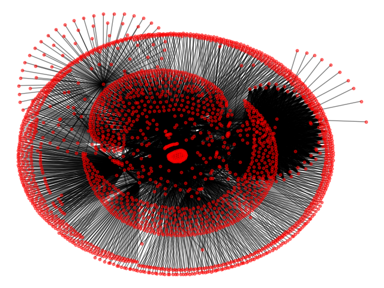

# Plague
### A WebCrawler

Not much at the moment... can crawl webpages for absolute urls pretty well. 

Graph made by using stackoverflow.com for seed and going for 50 iterations. 
(Had to keep the graph small for now because it can take a while to draw.)

